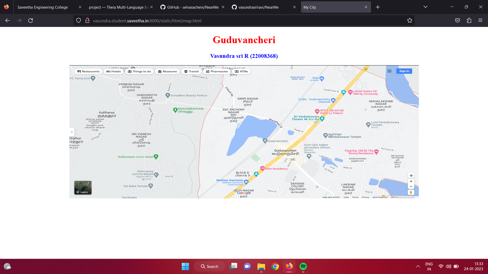
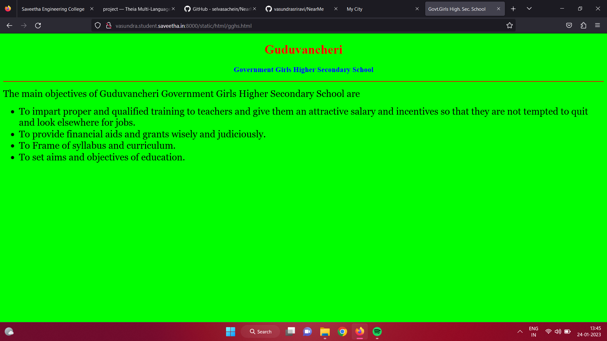
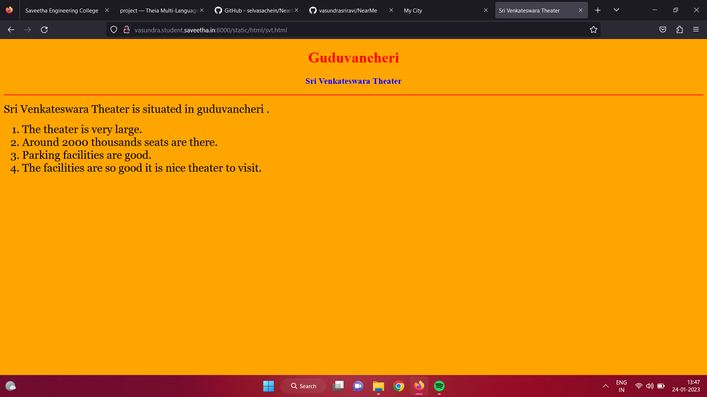
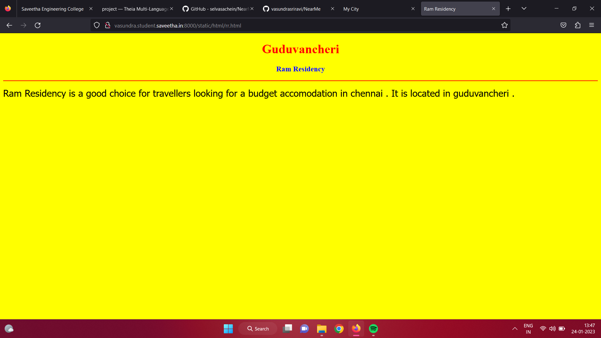
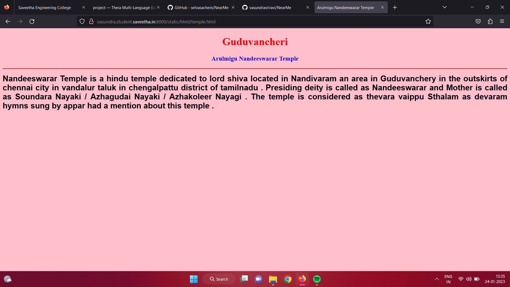
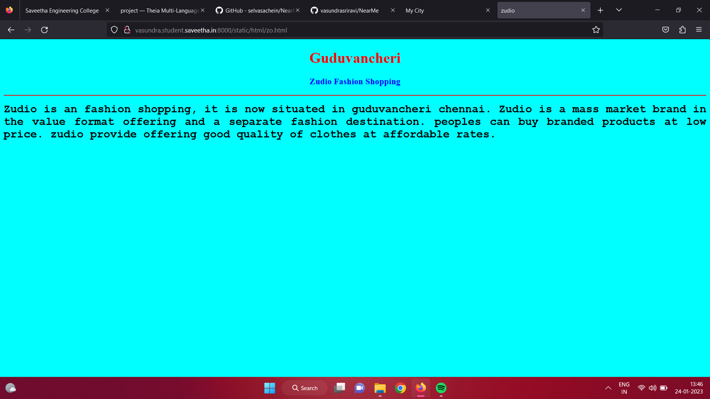
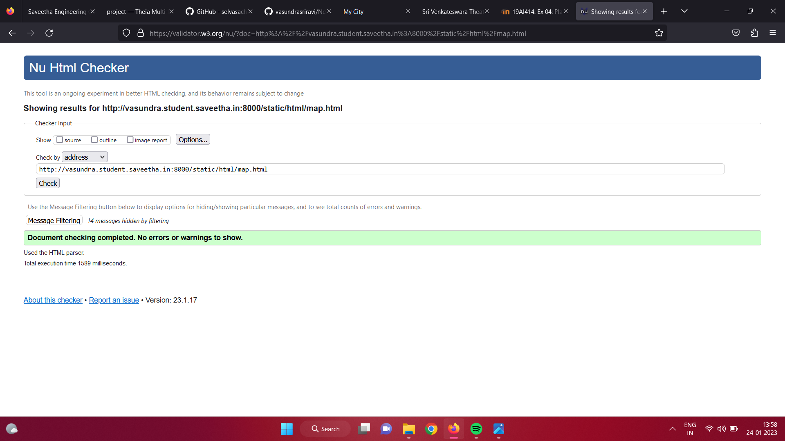

# Places Around Me
## AIM:
To develop a website to display details about the places around my house.

## Design Steps:

### Step 1:
Clone the github repository into Theia IDE

### Step 2:
Create a new Django project

## Step 3:
write the needed HTML code.

## Step 4:
Run the Django server and execute the HTML files.

## Code:
```
map.html
<!DOCTYPE html>
<html lang="en">
<head>
<title>My City</title>
</head>
<body>
<h1 align="center">
<font color="red"><b>Guduvancheri</b></font>
</h1>
<h3 align="center">
<font color="blue"><b>Vasundra sri R (22008368)</b></font>
</h3>
<center>

<map name="MyCity">
<area shape="circle" coords="190,50,20" href="/static/html/gghs.html" title="Govt.Girls Higher Secondary School">
<area shape="rectangle" coords="230,30,260,60" href="/static/html/zo.html" title="Zudio">
<area shape="circle" coords="400,350,50" href="/static/html/svt.html" title="Sri Venkateswara Theater">
<area shape="circle" coords="400,200,75" href="/static/html/rr.html" title="Ram Residency">
<area shape="rectangle" coords="490,150,870,320" href="/static/html/temple.html" title="Arulmigu Nandeeswarar Temple">
</map>
</center>
</body>
</html>

gghs.html
<!DOCTYPE html>
<html lang="en">
<head>
<title>Govt.Girls High. Sec. School</title>
</head>
<body bgcolor="lime">
<h1 align="center">
<font color="red"><b>Guduvancheri</b></font>
</h1>
<h3 align="center">
<font color="blue"><b>Government Girls Higher Secondary School</b></font>
</h3>
<hr size="3" color="red">
<p align="justify">
<font face="Georgia" size="5">
The main objectives of Guduvancheri Government Girls Higher Secondary School are 
<ul>
<li>To impart proper and qualified training to teachers and give them an attractive salary and incentives so that they are not tempted to quit and look elsewhere for jobs.</li>
<li>To provide financial aids and grants wisely and judiciously.</li>
<li>To Frame of syllabus and curriculum.</li>
<li>To set aims and objectives of education.</li>
</ul>
</font>
</p>
</body>
</html>

rr.html
<!DOCTYPE html>
<html lang="en">
<head>
<title>Ram Residency</title>
</head>
<body bgcolor="yellow">
<h1 align="center">
<font color="red"><b>Guduvancheri</b></font>
</h1>
<h3 align="center">
<font color="blue"><b>Ram Residency</b></font>
</h3>
<hr size="3" color="red">
<p align="justify">
<font face="Tahoma" size="5">
Ram  Residency   is  a  good  choice  for  travellers  looking  for  a  budget
accomodation  in  chennai .  It  is  located  in  guduvancheri . 
</font>
</p>
</body>
</html>

svt.html
<!DOCTYPE html>
<html lang="en">
<head>
<title>Sri Venkateswara Theater</title>
</head>
<body bgcolor="orange">
<h1 align="center">
<font color="red"><b>Guduvancheri</b></font>
</h1>
<h3 align="center">
<font color="blue"><b>Sri Venkateswara Theater</b></font>
</h3>
<hr size="3" color="red">
<p align="justify">
<font face="Georgia" size="5">
Sri  Venkateswara  Theater  is  situated  in  guduvancheri .  
<ol type="1">
<li>The theater is very large.</li>
<li>Around 2000 thousands seats are there.</li>
<li>Parking facilities are good.</li>
<li>The facilities are so good it is nice theater to visit.</li>
</ol>
</font>
</p>
</body>
</html>

temple.html
<!DOCTYPE html>
<html lang="en">
<head>
<title>Arulmigu Nandeeswarar Temple</title>
</head>
<body bgcolor="pink">
<h1 align="center">
<font color="red"><b>Guduvancheri</b></font>
</h1>
<h3 align="center">
<font color="blue"><b>Arulmigu Nandeeswarar Temple</b></font>
</h3>
<hr size="3" color="red">
<p align="justify">
<font face="Arial" size="5">
<b>
Nandeeswarar  Temple  is  a  hindu  temple  dedicated  to  lord   shiva   located  in  Nandivaram
an  area  in  Guduvanchery  in  the   outskirts  of  chennai  city  in  vandalur  taluk  in  chengalpattu
district  of   tamilnadu .
Presiding  deity  is  called  as  Nandeeswarar  and  Mother  is  called  as  Soundara  Nayaki  /  
Azhagudai  Nayaki  /  Azhakoleer  Nayagi .  The  temple  is  considered  as  thevara  vaippu
Sthalam  as  devaram  hymns  sung  by  appar  had  a  mention  about  this  temple .
</b>
</font>
</p>
</body>
</html>

zo.html
<!DOCTYPE html>
<html lang="en">
<head>
<title>zudio</title>
</head>
<body bgcolor="cyan">
<h1 align="center">
<font color="red"><b>Guduvancheri</b></font>
</h1>
<h3 align="center">
<font color="blue"><b>Zudio Fashion Shopping</b></font>
</h3>
<hr size="3" color="red">
<p align="justify">
<font face="Courier New" size="5">
<b>
Zudio is an fashion shopping, it is now situated in guduvancheri chennai. 
 Zudio is a mass market brand in the value format offering and a separate fashion destination.
 peoples can buy branded products at low price. 
zudio provide offering good quality of clothes at affordable rates.
</b>
</font>
</p>
</body>
</html>
```

## Output:







## HTML Validator


## Result:
The program executed successfully